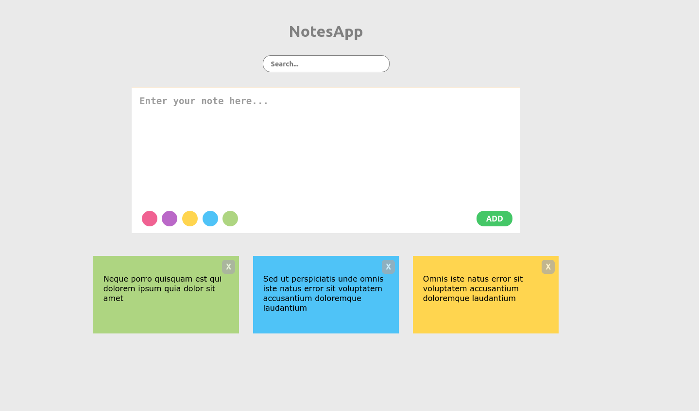

# eCommerce Clothes Store - ReactJS & Mockapi.io

See live: [https://redux-notesapp.netlify.app/](https://redux-notesapp.netlify.app/)

## Features
* Add note
* Choose background color for each note
* Search notes
* Delete Note

## Tools
* ReactJS
* Redux
* nanoid

## How To Run

In the project directory, you can run:

### `yarn start`
